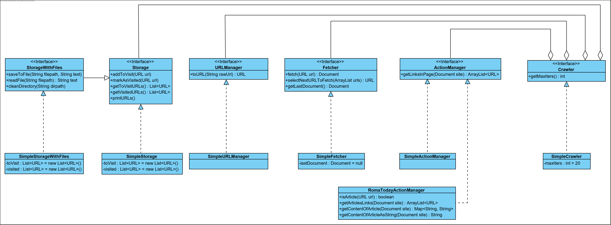

# WSIE repo

## What's this about?
This repository contains material and exercises for the **Web and Social Information Extraction** 2019/20 course at **Sapienza Università di Roma**.

Languages used are:
* **Java**, for the coding
* **UML**, for the diagrams

## What's inside?
* a **very simple web crawler** that scrapes and saves pages starting from the seeds given until there are no more urls in the crawling frontier or an iterations cap is reached

